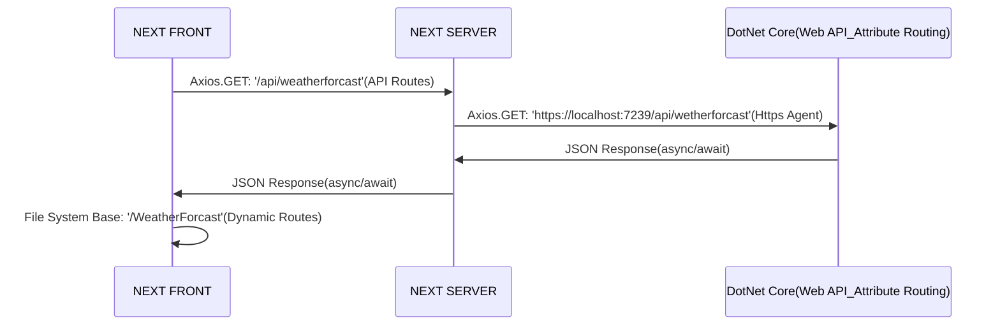

## 実行手順

```bash
git clone https://github.com/choukonn/dotNetNext.git
```

```bash
cd dotNetNext
dotnet run
```
> 必要かも
```bash
dotnet dev-certs https --trust
```

## NEXTフロントとDotNet Core通信



> **Attention:**

- NEXT(HTTP) ----> DotNet Core(HTTPS)
    - サーバー内部通信(Axios: Https Agent)
    - ブラウザ外部通信(CORS: api server need to add trust origin url)
- DotNet Core(HTTPS) ----> NEXT(HTTP)
    - SPA Proxy(configure file: *.csproj)

> **Problem:**

- NEXTのHTTPS化問題
    - NEXT公式から「カスタマイズサーバー」非推奨（nginx/apacha reverse proxy??）
- NEXT/REACTログ問題
    - フリーモジュール少ない(browser: console.log server: stdout --> Pino構造化ログ)
    - 課金：[logflare](https://logflare.app/pricing)   |  [sentry-エラーハンドリング](https://sentry.io/pricing/)
- NEXT/REACTユニットテスト問題

## [REACT Native + dotNet Core](https://docs.microsoft.com/en-us/aspnet/core/client-side/spa/react?view=aspnetcore-6.0&tabs=visual-studio)

```bash
dotnet new react -o my-new-app
cd my-new-app
dotnet run
```


## daidai2.0選定した技術スタック

### 言語

- Typescript
    - 静的型付け言語
- Go
    - 静的型付け言語
    - コンパイル単一バイナリ実行ファイル

### フレームワーク導入

- フロント側
    - NEXT.js
        - REACTコンポーネントベース
        - ファイルシステムベースのルーティング
        - reactよりbiludIn機能多い
    - CSS(component lib)
        - Chakra UI
        - Tailwind CSS(候補)
    - 状態管理
        - Recoil
- バックエンド側
    - GIN